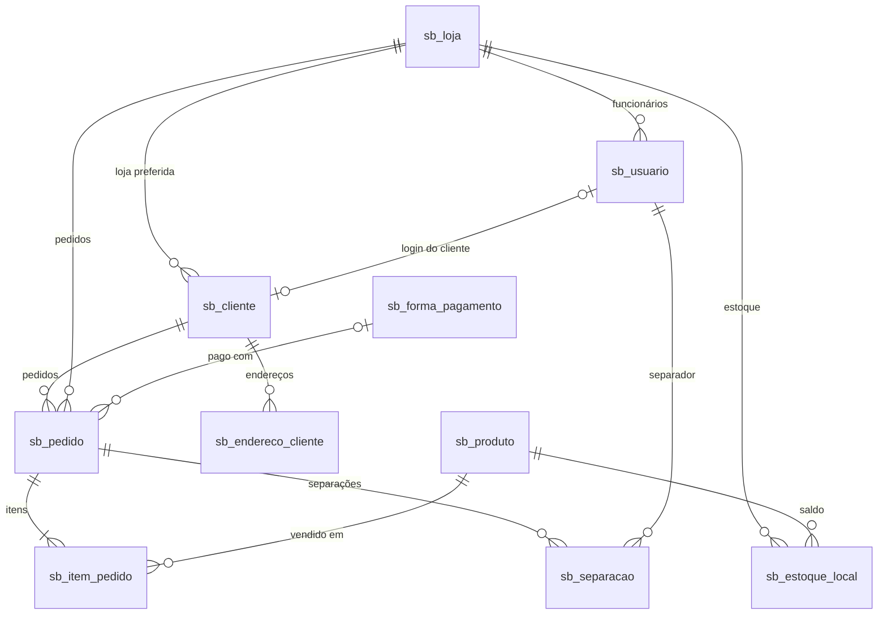
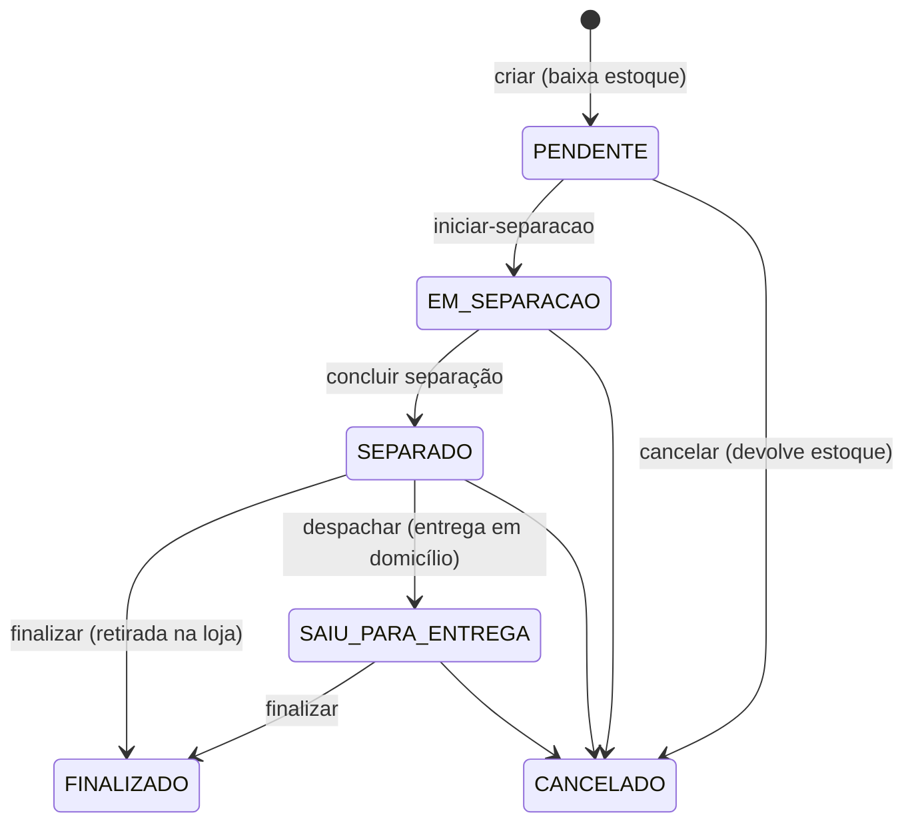
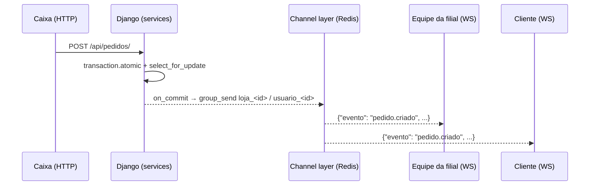

# Arquitetura

## Estrutura de pastas

```
superbenfica-api/
├── config/                  # Projeto Django
│   ├── settings/            # base, dev, prod, test
│   ├── urls.py              # Rotas HTTP raiz + Swagger
│   ├── asgi.py              # HTTP + WebSocket (Channels)
│   ├── wsgi.py              # Somente HTTP
│   └── celery.py            # Aplicação Celery
├── apps/
│   ├── core/                # Roles, permissões, mixins, rate limit, WebSocket, carga inicial
│   ├── filiais/             # Loja
│   ├── usuarios/            # Usuario (login por e-mail), JWT, autocadastro
│   ├── produtos/            # Produto (catálogo da rede), código de barras, fotos
│   ├── estoque/             # EstoqueLocal (saldo por filial) + serviços de movimentação
│   ├── clientes/            # Cliente, EnderecoCliente
│   ├── pagamentos/          # FormaPagamento (Pix, cartões, dinheiro, vale)
│   ├── pedidos/             # Pedido, ItemPedido, Separacao + fluxo de status e checklist
│   └── relatorios/          # Consultas agregadas com cache
├── tests/                   # pytest
├── docs/                    # Esta documentação + openapi.yaml
├── media/                   # Fotos de produto enviadas (MEDIA_ROOT; fora do Git)
├── nginx/                   # Proxy reverso
└── .github/workflows/       # CI com SonarQube
```

Cada app segue a mesma organização:

| Arquivo | Responsabilidade |
|---------|------------------|
| `models.py` | Entidades, constraints e índices |
| `serializers.py` | Validação de entrada e formato de saída |
| `views.py` | ViewSets, permissões e documentação Swagger (`extend_schema`) |
| `services.py` | Regras de negócio transacionais (estoque, pedidos, relatórios) |
| `tasks.py` | Tasks Celery |
| `urls.py` | Rotas do app |
| `admin.py` | Django Admin |

As views ficam enxutas: toda regra que altera mais de uma tabela ou exige bloqueio fica em `services.py`.

## Modelo de dados



Regras garantidas pelo banco:

| Tabela | Regra |
|--------|-------|
| `sb_produto` | `sku` único; `preco > 0`; `codigo_barras` único quando preenchido (GTIN validado na aplicação) |
| `sb_estoque_local` | um registro por (produto, loja); `quantidade >= 0`; `quantidade_minima >= 0` |
| `sb_item_pedido` | um item por (pedido, produto); `quantidade > 0`; `preco_unitario > 0` |
| `sb_endereco_cliente` | no máximo um endereço `principal` por cliente |
| `sb_separacao` | no máximo uma separação `EM_ANDAMENTO` por pedido |
| `sb_forma_pagamento` | `nome` único |

Registros com histórico não são apagados. Filiais, produtos, formas de pagamento e usuários são **desativados** (`ativa`/`ativo`/`is_active = false`), e pedidos protegem cliente, loja, produto e forma de pagamento (`on_delete=PROTECT`).

`sb_pedido.forma_pagamento` aceita nulo no banco só por causa dos pedidos anteriores a essa coluna; a API exige uma forma ativa em todo pedido novo. As formas padrão são cadastradas pela migration `pagamentos.0002`.

## Fluxo do pedido



- **Forma de entrega:** o pedido de retirada na loja é finalizado no caixa logo depois de separado. O de entrega em domicílio passa obrigatoriamente por `SAIU_PARA_ENTREGA` antes de ser finalizado, e o de retirada nunca sai para entrega (HTTP 409).

- **Concorrência:** criar, cancelar e mudar de status são operações dentro de `transaction.atomic` com `select_for_update`. Duas vendas simultâneas não consomem o mesmo saldo, e duas pessoas não alteram o mesmo pedido ao mesmo tempo.
- **Preço congelado:** `ItemPedido.preco_unitario` guarda o preço do momento da compra.
- **Checklist da separação:** durante `EM_SEPARACAO`, o separador responsável (ou ADMIN/GERENTE) marca cada item em `POST /api/separacoes/{id}/marcar-item/` (`ItemPedido.separado`). Cada mudança publica `pedido.atualizado`. A conclusão não exige todos os itens marcados; essa conferência fica no painel.
- **Erros de negócio:** estoque insuficiente, produto indisponível e transição inválida retornam **HTTP 409**.

## Tempo real (WebSocket)



Os eventos são enviados só depois do commit (`transaction.on_commit`), então ninguém recebe notificação de uma operação desfeita. Se o Redis falhar, o erro vai para o log e a requisição não é interrompida.

O channel layer usa `socket_timeout` de `CHANNEL_LAYER_SOCKET_TIMEOUT` segundos (padrão 15). Ele precisa ser maior que o bloqueio de 5 s do `channels_redis`: com o padrão do redis-py (5 s), a leitura estourava, o consumer caía (código 1011) e o cliente reconectava a cada ~10 s.

## Tarefas assíncronas (Celery Beat)

| Task | Frequência | O que faz |
|------|-----------|-----------|
| `apps.estoque.tasks.verificar_estoque_minimo` | a cada hora | Publica `estoque.abaixo_do_minimo` para cada filial |
| `apps.relatorios.tasks.gerar_resumo_diario` | diária | Guarda as vendas do dia anterior no cache por 7 dias |

## Cache

Os relatórios de vendas, produtos mais vendidos e pedidos por status ficam em cache no Redis por `CACHE_TTL_RELATORIOS` segundos. A chave combina relatório, filial, período e limite. O relatório de **estoque baixo não usa cache**: ele orienta a reposição e precisa mostrar o saldo atual.

## Rate limit

Além dos limites globais do DRF (`anon` por IP e `user` por usuário), endpoints sensíveis ou custosos têm um escopo próprio via `ScopedRateThrottle`. Os nomes ficam em `apps.core.throttling.Escopo`; o `ThrottlePorAcaoMixin` aplica o escopo só a ações específicas de um ViewSet (ex.: `create` de pedidos, `ajustar` de estoque). Os limites vêm de `THROTTLE_*` no `.env` (tabela completa em [api.md](api.md#rate-limit)). A contagem usa o cache do Django, então em produção, com Redis, ela é compartilhada por todos os processos.

## Fotos de produto

O upload (`POST /api/produtos/{id}/foto/`, multipart) passa por `apps.produtos.fotos`:

1. Recusa arquivos acima de 2 MB ou com mais de 40 milhões de pixels (proteção contra *decompression bomb*).
2. Abre com o Pillow e aceita só JPEG, PNG ou WebP, decidindo pelo conteúdo, não pela extensão.
3. Corrige a orientação, reduz para no máximo 1200 px e **regrava em WebP**: metadados (EXIF/GPS) e conteúdo embutido são descartados.
4. Salva com nome UUID em `MEDIA_ROOT/produtos/` e apaga a foto anterior.

Em desenvolvimento (`DEBUG=True`) o Django serve `/media/`. No Docker, os arquivos ficam no volume `media` e o Nginx os serve somente leitura, aceitando apenas extensões de imagem e com `Content-Security-Policy` restritiva.

## Configuração por ambiente

| Settings | Banco | Redis | Observações |
|----------|-------|-------|-------------|
| `dev` | PostgreSQL do `.env` | opcional | `DEBUG=True`, sessão habilitada para o Swagger |
| `prod` | PostgreSQL do `.env` | **obrigatório** | HTTPS, HSTS, cookies seguros; não inicia sem `SECRET_KEY`, `ALLOWED_HOSTS` ou `REDIS_URL` |
| `test` | SQLite em memória | em memória | Nunca acessa o Supabase |
